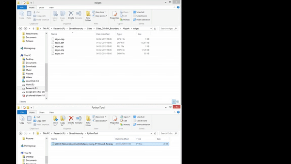

This is the Python version of the COINS tool. Although it can be run on any IDLE (Spyder, Pycharm, Jupyter Notebook, etc.), it is advised to run the script from the command prompt shell for faster processing. 

## Installation instructions
1. Install Python 3x and necessary libraries including NumPy and PyShp. 
2. Place the input files/ file in a directory. Make sure any other shapefile (point or polygon) is not present in the directory. 
3. In the script, update the working directory in line 458. 
4. Open the command prompt shell in the directory where your Python script is located. 
5. Use the following command. 
&nbsp;If Python is added to your PC's environment path variables: 
&nbsp;&nbsp;`python NameOfTheScript.py` 
&nbsp;If Python is not in your PC's environment path variables: 
&nbsp;&nbsp;`path/to/python NameOfTheScript.py` 

The video below demonstrates to use the tool when Python is not added to PC's environment path variables. 
(Click to open high-resolution video) 

