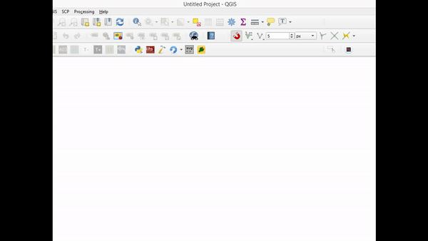
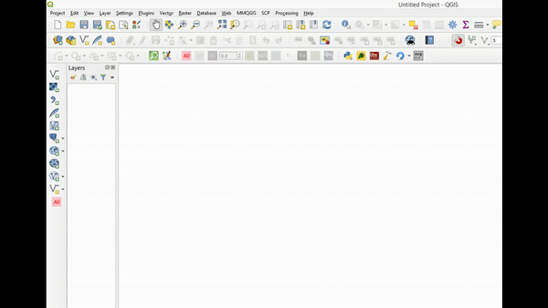

# COINS - Continuity in Street Networks | QGIS Plugin

This repository contains the source code of the COINS QGIS plugin. The plugin is available on the official QGIS plugin repository [here](https://plugins.qgis.org/plugins/coins/)—it can be installed from inside the QGIS interface. The image below shows the screenshot of the COINS QGIS plugin. 
 
If not the icon, the plugin can also be found in **Vector>COINS - Continuity in Street Networks** menu.  

**Note:** The plugin has been marked as experimental for now. Make sure that you check the **show experimental plugins** box in the settings, as shown below. 
 
This can be done from the **Plugins>Manage and Install Plugins...>Settings>Show also experimental plugins** menu.  

The plugin is the output of published journal article published, check details [here](../../../). For automation or batch processing purposes, find the back-end algorithm of this plugin as a Python script [here](../PythonTool).
