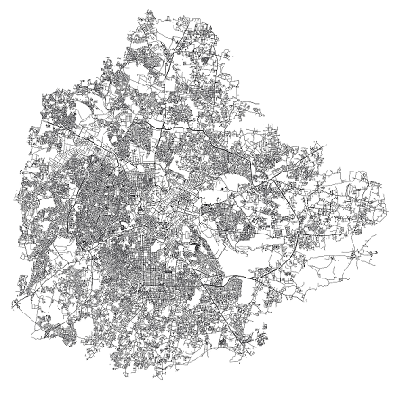
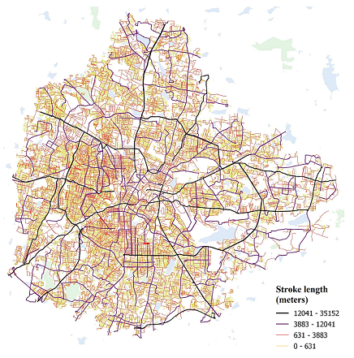

# COINS - Continuity in Street Networks
This repository contains the source code of the COINS tool that allows to deduce natural continuity of street network. For continuity of streets, the deflection angle between adjacent segments are computed, the user can provide the desired angle threshold. Segments will only be considered a part of the same street if the deflection angle is above the threshold, the default value is zero.<br/>

The image below shows the input street network data from the OSM, and its corresponding output from the COINS tool. For visualisation purpose, classification (natural breaks 'Jenks') was done on the length of the street strokes in the resulting shapefile.<br/>



There are two ways of accessing the tool, one is the Python script, which can be found here [[link]](/PythonTool). Second way of using is the QGIS plugin, source code and details are here [[link]](/QGISplugin).<br/>

**Suggested citation**<br/>
Tripathy, P., Rao, P., Balakrishnan, K., & Malladi, T. (2020). An open-source tool to extract natural continuity and hierarchy of urban street networks. Environment & Planning B: Urban Analytics & City Science (Article in press)<br/>

## Bibtext entry:
```tex
@Article{xxxxx,
AUTHOR = {Tripathy, Pratyush and Rao, Pooja and Balakrishnan, Krishnachandran and Malladi, Teja},
TITLE = {An open-source tool to extract natural continuity and hierarchy of urban street networks},
JOURNAL = {Environment & Planning B: Urban Analytics & City Science},
VOLUME = {xx},
YEAR = {2020},
NUMBER = {x},
ARTICLE-NUMBER = {xxx},
URL = {https://xxxxxxxxxxxxxxxxxxxxxxxxx},
ISSN = {xxxx-xxxx},
ABSTRACT = {Will be updated with the final version},
DOI = {10.xx.xx/xxx}
}
```

**Affiliation**<br/>
Geospatial Lab, Indian Institute for Human Settlements, Bengaluru - 560080, India<br/>

**Funding**<br/>
This work was completed with support from the PEAK Urban programme, funded by UKRI’s Global Challenge Research Fund, Grant Ref: ES/P011055/1
