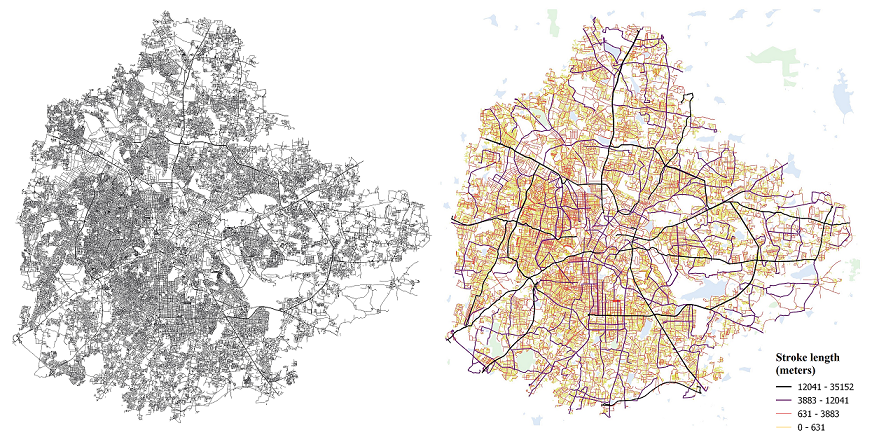

# CONTRA - Continuous Roads Algortihm
This repository contains the source code of the CONTRA tool that allows to deduce natural continuity of street network. 

The image below shows the input street network data from the OSM, and its corresponding output from the CONTRA tool. For visualisation purpose, classification (natural breaks 'Jenks') was done based on the length of the street strokes in the resulting shapefile. 

There are two ways of accessing the tool, one is the Python script, which can be found [here](/PythonTool). Second way of using is the QGIS plugin, source code and details are [here](/QGISplugin).

The details of the algorithm is mentioned in the following journal article. 
### An open-source tool to extract natural continuity and hierarchy of urban street networks.[forthcoming]  
Pratyush Tripathy, Pooja Rao, Krishnachandran Balakrishnan & Teja Malladi  
Geospatial Lab, Indian Innstitute for Human Settlements, Bengaluru - 560080, India 

Maintainer: Pratyush Tripathy 
Email: pratyush@iihs.ac.in, pratkrt@gmail.com
